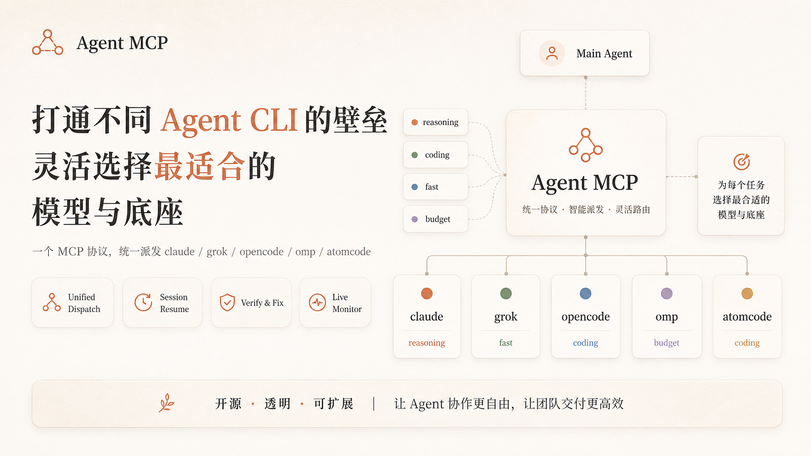

# Agent MCP

> **Skill-first universal Agent runtime** — let one host Agent safely dispatch, monitor, steer and resume work across multiple Agent CLIs through a standard MCP capability layer.

Current version: **v3.0.0a1**. Version source: `agent_mcp/__init__.py`. See [CHANGELOG.md](CHANGELOG.md) and the [v3 roadmap](docs/plans/2026-08-24-v3-roadmap.md).

<p align="center">
  
</p>

## What Agent MCP is

Agent MCP is **not just an MCP server**, and it is **not a pure Skill**.

It uses three layers with different responsibilities:

```text
User task
   |
   v
Host Agent
   |
   | loads orchestration policy
   v
Skill layer
   |  decides whether/how to delegate
   |  chooses role / CLI / model / topology
   v
MCP layer
   |  exposes stable typed capabilities
   |  spawn / wait / steer / follow-up / memory / policy
   v
Daemon runtime
   |  queues / sessions / processes / retries / persistence / SSE
   v
Claude / Codex / OMP / OpenCode / Grok / Kimi / Copilot / Pi / ...
```

**Skill = orchestration control plane.**  
It teaches the host Agent when delegation is worth the overhead, how to split work, which specialist/backend to choose, and how to judge results.

**MCP = capability plane.**  
It gives different Agent hosts one stable interface instead of making every host understand Agent MCP's scripts and process internals.

**Daemon = execution plane.**  
It owns long-running mutable state: workers, queues, sessions, timeouts, retries, usage, memory, policies and observability.

Read the full design in [docs/architecture.md](docs/architecture.md). The decision to keep this hybrid architecture is recorded in [ADR-0001](docs/decisions/0001-skill-first-mcp-runtime.md).

---

## Why use it

Without Agent MCP, Agent CLIs are isolated execution environments. A parent Agent may know that another CLI/model would be better for one branch, but it lacks a uniform way to delegate, monitor and resume that work.

Agent MCP turns them into one reusable worker pool:

```text
Task characteristics
      ↓
Host Agent + Skill
      ↓
choose the best CLI × model for this branch
      ↓
Agent MCP runtime
      ↓
structured result + evidence + usage
```

The host Agent still owns semantic reasoning. The runtime handles execution mechanics and failure containment.

### Good fits

- parallel repository exploration;
- architecture + implementation + review workflows;
- long-running workers that need steering/follow-up;
- cross-vendor review (writer and reviewer on different CLIs);
- tasks that exceed one Agent's comfortable context window;
- durable multi-Agent work that must survive a reconnect.

### Bad fits

- two-line edits;
- quick questions;
- one small file with tightly coupled changes;
- work whose coordination cost is larger than simply doing it directly.

The bundled Skill explicitly defaults to **direct execution first, delegation only when useful**.

---

## Quick install

### One-line installer

macOS / Linux (Windows: Git Bash or WSL):

```bash
curl -fsSL https://raw.githubusercontent.com/37chengshan/agent-mcp/main/install.sh | bash
```

> The command executes a remote script with your current user permissions. Review [`install.sh`](install.sh) first if you prefer a stricter supply-chain workflow, or pin the URL to a commit SHA.

The installer can register Agent MCP across supported hosts and install the orchestration Skill where that host supports the Skill workflow.

### Clone + install

```bash
git clone git@github.com:37chengshan/agent-mcp.git
cd agent-mcp
python3 install.py --install --host all
python3 start_agent_mcp.py --open
```

Use `--dry-run` to preview config changes and `--rollback` to restore installer backups.

Full installation and host-specific registration: [docs/install-guide.md](docs/install-guide.md).

### DeepSeek Harness

DeepSeek Harness can connect to `mcp_server.py` through stdio and use the runtime tools directly. See [docs/dsh-integration.md](docs/dsh-integration.md) for the maintained profile example and validation steps.

---

## Core capabilities

| Layer | Capability | What it does |
|---|---|---|
| Skill | Complexity gate | S/M/L advisory gate; defaults to no delegation for small tasks |
| Skill | Cognitive-locality planning | Avoids splitting branches that need the same evolving context |
| Skill | Specialist presets | Planner, architect, explorer, reviewer, security reviewer, TDD, E2E and more |
| Skill | Task briefs | Scope, boundaries, self-check, output contract and escalation states |
| MCP | `spawn_agent` | Start a worker on an explicit CLI/model/workspace |
| MCP | `wait_agent` | Structured bounded wait for a worker state/result |
| MCP | `steer_agent` | Redirect an active worker while preserving its logical node/session where supported |
| MCP | `followup_task` | Re-enter the same worker context for corrections or a next turn |
| MCP | `orchestrate_task` | Execute an already-declared dependency DAG |
| Runtime | Queue/concurrency | Slot control and queued execution |
| Runtime | Durable sessions | Reconnect and continue supported worker sessions |
| Runtime | Verification/retry | Run deterministic checks and re-enter a worker on failure |
| Runtime | Timeout containment | Kill the complete process tree on task timeout |
| Runtime | Usage/cost | Persist and expose token/cost telemetry |
| Runtime | Memory | Cross-session project memory primitives |
| Runtime | Policies | Budget / approval / tool-limiting runtime enforcement |
| Runtime | Observability | SSE event stream and web dashboard |
| Runtime | CLI adapters | Normalize commands, sessions, events and usage across Agent CLIs |

The current capability truth table is maintained in [docs/capability-matrix.md](docs/capability-matrix.md).

---

## The important boundary

A recurring source of architecture drift is confusing **semantic orchestration** with **runtime scheduling**.

The Skill/host Agent should decide:

```text
What should be split?
Which specialist should own each branch?
Which CLI/model is suitable?
What counts as success?
Which result needs another review?
```

The daemon should execute explicit mechanics:

```text
A and B have no dependency -> run concurrently
C depends on A -> start after A
worker timed out -> terminate process tree
verification failed -> retry/follow-up within policy
connection reopened -> recover durable task state
```

That separation is the reason Agent MCP keeps both a Skill and an MCP/runtime implementation.

---

## Runtime architecture

```text
┌──────────────────────────────┐
│ Host Agent                   │
│ Codex / Claude / OMP / ...   │
└──────────────┬───────────────┘
               │ Skill policy
               v
┌──────────────────────────────┐
│ skill/SKILL.md               │
│ • delegate?                  │
│ • decompose                  │
│ • choose role/CLI/model      │
│ • brief + judge              │
└──────────────┬───────────────┘
               │ MCP tools
               v
┌──────────────────────────────┐
│ mcp_server.py                │
│ thin, mostly stateless       │
│ protocol + session boundary  │
└──────────────┬───────────────┘
               │ local authenticated RPC
               v
┌──────────────────────────────┐
│ agent_mcp/daemon_main.py     │
│ durable execution runtime    │
│ queue / sessions / SQLite    │
│ verify / cache / SSE         │
└──────────────┬───────────────┘
               │ CLI adapters
               v
 Claude / Codex / OMP / OpenCode / Grok / Kimi / ...
```

Implementation diagram: [docs/architecture.svg](docs/architecture.svg)  
Workflow diagram: [docs/workflow.svg](docs/workflow.svg)  
Runtime responsibilities: [docs/runtime.md](docs/runtime.md)

---

## Repository structure

```text
skill/
  SKILL.md              # compact orchestration control plane
  cli-guide.md          # loaded only when choosing a backend/model
  task-brief.md         # loaded when preparing a delegated contract
  runtime-guide.md      # loaded after dispatch or on runtime trouble
  agents/               # role presets, loaded one at a time
  scripts/              # deterministic helpers such as low-context waiting

mcp_server.py            # thin MCP capability facade

agent_mcp/
  daemon_main.py         # durable runtime coordinator
  daemon_http.py         # local API + SSE
  db.py                  # persistent task/event/usage state
  state_machine.py       # worker lifecycle
  cli_adapters.py        # Agent CLI normalization
  orchestrator.py        # explicit DAG execution mechanics
  policies/              # runtime governance
  sandbox/               # execution-policy mappings

web/                     # observability UI

docs/                    # human/contributor documentation
  README.md              # documentation hub
  architecture.md        # canonical three-layer architecture
  runtime.md             # runtime ownership/lifecycle
  decisions/             # architecture decision records
  plans/                 # historical implementation plans
  research/              # technical/benchmark evidence snapshots
  review/                # iteration reviews

tests/                   # unit/integration/stdio/CLI smoke tests
```

---

## Documentation

Start with the [documentation hub](docs/README.md).

- **Architecture:** [docs/architecture.md](docs/architecture.md)
- **Runtime:** [docs/runtime.md](docs/runtime.md)
- **Architecture decision:** [ADR-0001](docs/decisions/0001-skill-first-mcp-runtime.md)
- **Install:** [docs/install-guide.md](docs/install-guide.md)
- **DeepSeek Harness:** [docs/dsh-integration.md](docs/dsh-integration.md)
- **Custom CLI adapters:** [docs/custom-cli.md](docs/custom-cli.md)
- **Capability matrix:** [docs/capability-matrix.md](docs/capability-matrix.md)
- **Acceptance:** [docs/acceptance.md](docs/acceptance.md)
- **Agent orchestration entrypoint:** [skill/SKILL.md](skill/SKILL.md)

Historical design plans and research remain available under `docs/plans/`, `docs/research/` and `docs/review/`, but they are not the canonical entrypoint for current architecture.

---

## Design rule in one sentence

> **Let the Skill decide how work should be orchestrated; let MCP expose stable capabilities; let the daemon reliably execute and remember what happened.**
