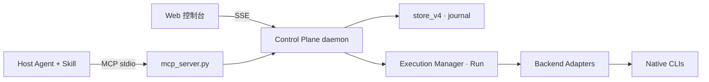

# Agent MCP

<p align="center">
  
</p>

<p align="center">
  <strong>Skill-first · MCP-backed Agent Control Plane</strong><br>
  把任意 Agent CLI 统一成可派发 / 可监控 / 可续接 / 可终止的工作池
</p>

<p align="center">
  
  
  
  
  
  
</p>

<p align="center">
  
  
</p>

<p align="center">
  版本 <strong>v4.0.0a1</strong> · 单一来源 <a href="agent_mcp/__init__.py">agent_mcp/__init__.py</a>
  · <a href="CHANGELOG.md">CHANGELOG</a>
  · <a href="docs/plans/2026-08-28-v4-roadmap.md">v4 路线图</a>
  · <a href="docs/dsh-integration.md">DSH 接入</a>
</p>

---

## 这是什么

三层架构（详见 [architecture.md](docs/architecture.md) · [ADR-0001](docs/decisions/0001-skill-first-mcp-runtime.md)）：

```text
Skill   是否委派 · 怎么拆 · 选 CLI×模型 · 怎么验收     ← 编排控制面
  ↓
MCP     稳定工具面 · 会话隔离 · daemon 拉起            ← 能力面（薄、无状态）
  ↓
Daemon  队列 · 进程 · Run/Goal/Schedule · 策略 · SSE   ← 执行面
  ↓
Native Runtime   claude / codex / omp / prime / custom  ← 真正执行
```

**边界**：模型推理与工具执行留在原生 CLI；agent-mcp 只做编排、调度、托管、观测与治理。

```text
不是：Agent MCP → 同一个 CLI
而是：任务特征 → Agent MCP → 最合适 CLI × 最合适模型
```



---

## 快速开始

### 1. 安装

```bash
# 交互：指定 host（推荐显式；all = 全部 21 个 host，会改多套配置）
git clone git@github.com:37chengshan/agent-mcp.git && cd agent-mcp
python3 install.py --install --host claude
python3 start_agent_mcp.py --open
```

```bash
# 非交互管道必须写 AGENT_MCP_HOST，否则只下载、不注册
AGENT_MCP_HOST=codex,claude \
  curl -fsSL https://raw.githubusercontent.com/37chengshan/agent-mcp/main/install.sh | bash
```

| 模式 | 行为 |
|---|---|
| `--host claude` | 只写 Claude 配置（MCP + Skill） |
| `--host all` | **全部 21 host**（六主载体 + 15 扩展），改写多套用户配置 |
| `--dry-run` | 只预览不写盘 |
| `--rollback` | 从备份恢复 |

主载体（MCP+Skill）：`codex` `claude` `omp` `opencode` `kimi` `zcode`  
扩展 host（多只注册 MCP）：`grok` `cursor` `gemini` `pi` `copilot` `cline` `qwen` `devin` `windsurf` `amazon-q` `atomcode` `kiro` `goose` `hermes` `crush`

> 安装结束只打印仓库首页链接，**不自动开浏览器 / 不调用 gh star**。  
> 诊断：`python3 start_agent_mcp.py --doctor`  
> DeepSeek Harness：`dsh plugin --profile web add dsh-plugin-agentmcp`（见 [packages/dsh-plugin](packages/dsh-plugin) · [dsh-integration.md](docs/dsh-integration.md)）

### 2. 打开控制台

```bash
python3 start_agent_mcp.py --open
# → http://127.0.0.1:8765（token 经 0600 bootstrap 文件交付，不经 argv）
```

| 会话文件夹 | 对话树 | 仪表盘 |
|:---:|:---:|:---:|
| 左栏分类筛选 | 流动边 · 节点可拖 · 画布缩放 | Run/Goal·Token·策略·工作区 |


---

## 能力一览

| | |
|---|---|
| **派发** | `spawn_agent` · `orchestrate_task`（DAG）· 复杂度分级门 S/M/L |
| **续接** | `steer_agent` · `followup_task` · `resume` · 任务级超时 |
| **观测** | `wait_agent` · `get_agent_activity` · `get_token_usage` · Web SSE |
| **治理** | 策略链（预算/审批/限权）· 验证回投 · 会话隔离 · 审计 |
| **v4 控制面** | Run 唯一执行单位 · Goal/Schedule · `/api/v4` journal 幂等 |
| **知识** | Harness revision/rollback · 三段式 refine · 记忆银行 |
| **协作** | mailbox P2P · consensus_vote |

> 完整工具目录以 **`mcp_server.py` 的 `tools/list`**（当前 34）与 [capability-matrix.md](docs/capability-matrix.md) 为准。

**诚实标注**
- 沙箱 `SANDBOX_MAP` **未接执行链**（生效的是适配器 `PERMISSION_FLAGS`）；容器沙箱 `AGENT_MCP_SANDBOX_IMAGE` 实验开关
- `verify_command` **默认拒绝**，须配置 `AGENT_MCP_VERIFY_ALLOW_PREFIXES`
- Prime Agent 适配器已接入，能力默认 **DEGRADED**，真实冒烟 ⏳

---

## 安全加固（2026-09）

| 面 | 措施 |
|---|---|
| 凭据 | `daemon.json` / env 文件 `O_CREAT\|0600`；`state_dir` 0700；token 不进进程 argv |
| 鉴权 | `X-Auth-Token` + `hmac.compare_digest`；`?token=` 仅 SSE；CSP `script-src 'self'` |
| 会话隔离 | 变更类操作强制非空 `session_id`；mailbox 所有权校验 |
| 命令面 | `verify_command` allowlist 默认 deny；custom-cli 拒绝绝对路径/覆盖内置 |
| 幂等 | journal `created` 标志防双执行；孤儿 `recorded` → `uncertain` 可恢复；服务端重算 `request_hash` |
| 子进程 | worker `env` 走 0600 文件并剥离 `LD_PRELOAD`/`PYTHON*` 等危险键 |

---

## 项目结构

```text
mcp_server.py            # MCP 薄层（能力面）
start_agent_mcp.py       # 启动 · --open · --doctor
install.py / install.sh  # host 注册 · 备份回滚
agent_mcp/               # daemon · execution · store_v4 · adapters · policies
packages/dsh-plugin/     # DSH bundle 插件（dsh-plugin-agentmcp）
web/                     # v4 控制台 + 仪表盘面板（含动效）
skill/                   # 编排 Skill（控制面）+ 内置 Agent
docs/                    # 架构 · ADR · 能力矩阵 · DSH/安装指南 · 品牌资产
tests/                   # 600+ 单测
```

---

## 文档

| 文档 | 用途 |
|---|---|
| [install-guide.md](docs/install-guide.md) | AI 可读安装说明 |
| [dsh-integration.md](docs/dsh-integration.md) | DeepSeek Harness 接入 |
| [architecture.md](docs/architecture.md) · [runtime.md](docs/runtime.md) | 三层职责 / 运行时边界 |
| [capability-matrix.md](docs/capability-matrix.md) | 适配器能力（✅/⏳） |
| [custom-cli.md](docs/custom-cli.md) | 自定义 CLI 接入 |
| [skill/SKILL.md](skill/SKILL.md) | 编排 Skill 全文 |
| [CHANGELOG.md](CHANGELOG.md) | 变更记录 |

---

## 开发

```bash
python3 -m pytest -m "not integration" -q   # 单测（默认跳过真实 CLI 冒烟）
python3 start_agent_mcp.py --doctor         # 健康体检 JSON
```

License [MIT](LICENSE)
