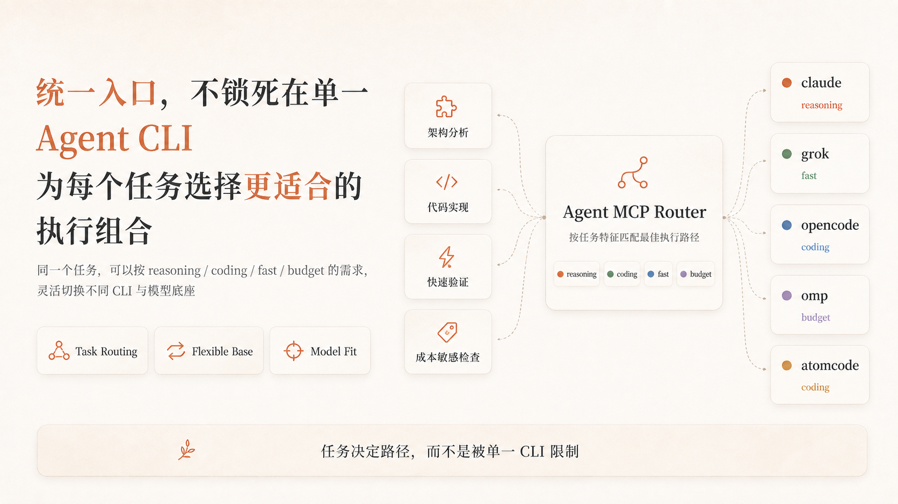
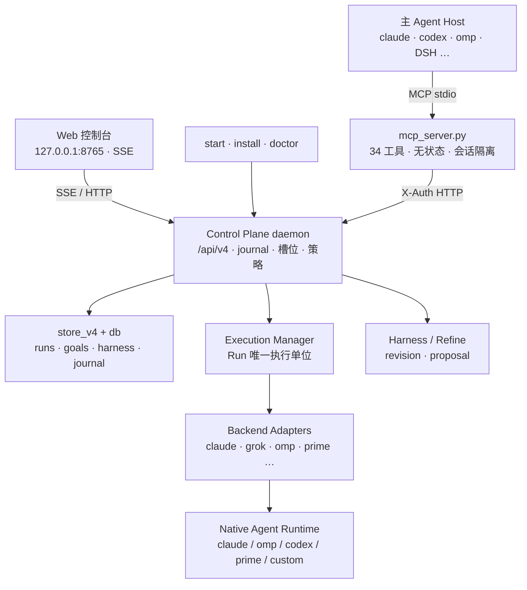
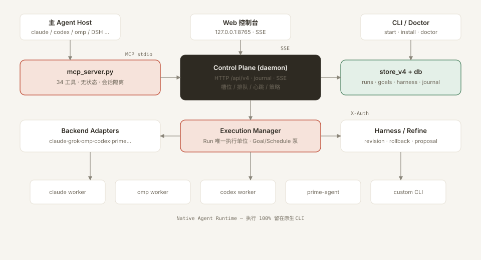
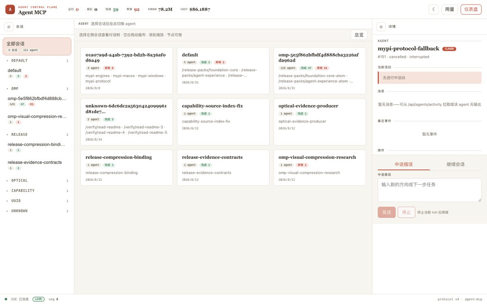
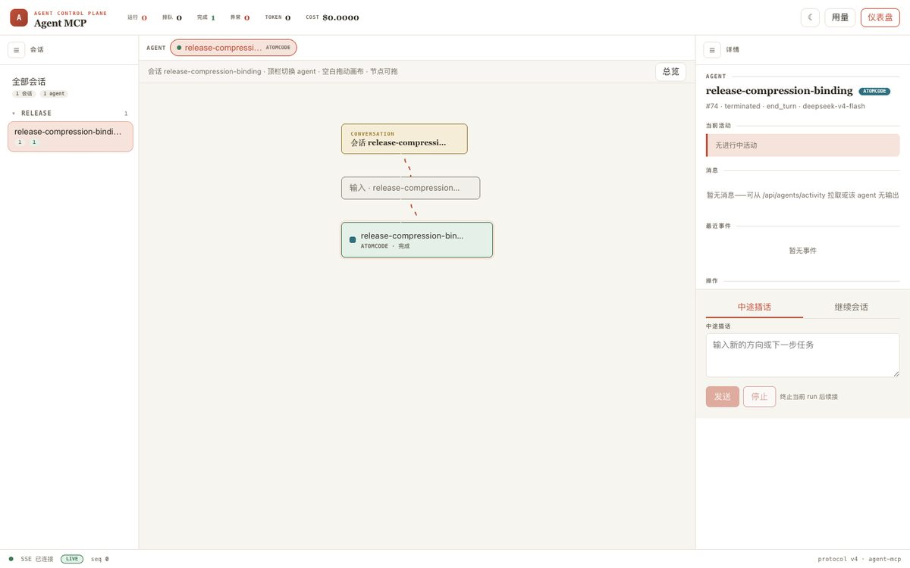
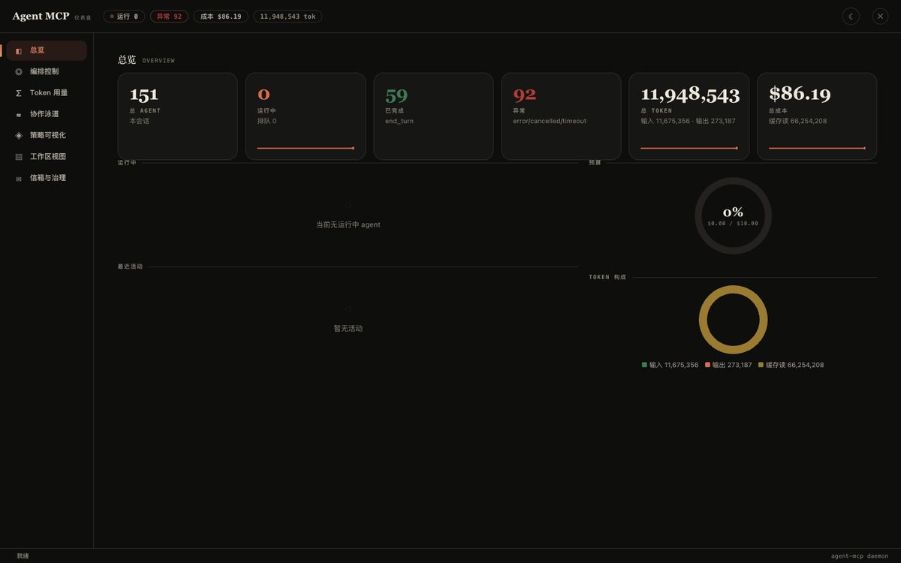

# Agent MCP

<p align="center">
  <strong>Agent Control Plane</strong> — 把任意 Agent CLI 统一成可派发 / 可监控 / 可续接 / 可终止的工作池
</p>

<p align="center">
  
  
  
  
  
</p>

> 当前版本 **v4.0.0a1**（单一来源：`agent_mcp/__init__.py`；变更记录见 [CHANGELOG.md](CHANGELOG.md)；v4 路线图见 [docs/plans/2026-08-28-v4-roadmap.md](docs/plans/2026-08-28-v4-roadmap.md)）。

> **✅ v4：Agent Control Plane** —— Run 唯一执行单位、Goal/Schedule 触发、Harness/Refine 可审计知识层、控制台重做。Prime Agent 适配器已接入（能力契约；真实冒烟 ⏳）。

## 🟦 原生支持 DeepSeek Harness（DSH）

**在 DeepSeek Harness 的 AI 会话中直接用上 agent-mcp 的全部 34 个 MCP 工具**（`mcp__agentmcp__spawn_agent` / `wait_agent` / `estimate_complexity` / `steer_agent` / `followup_task` / `goal_create` / `schedule_create` / `harness_list` / `memory_store` …）：DSH 以 stdio transport 直连 `mcp_server.py`，**一行 `insert` patch 即接入**——零插件开发、零代码改造；daemon 未起时自动原子拉起，子进程崩溃自动指数退避重连，重启后会话可续接。协议层对齐 **MCP 2026-07-28 最新规范**（无状态核心、`server/discover`、tasks 扩展、structuredContent），同时兼容 2025-11-25（DSH SDK 1.29.0 实际协商版本）与 2025-03-26 legacy 客户端。

```yaml
# ~/.dsh/profiles/<name>/cordis.patch.yml（或 $DSH_HOME/cordis.patch.yml）—— 加入即启用
- insert:
    - id: mcp-agentmcp
      name: '@deepseek-ai/dsh-mcp-client'
      config:
        serverName: agentmcp
        transport: stdio
        command: python3
        args: ['/绝对路径/agent-mcp/mcp_server.py']
```

完整接入步骤、agent preset 平面模板与验证清单见 [docs/dsh-integration.md](docs/dsh-integration.md)。

---

**打通所有 Agent CLI 壁垒的多 Agent 编排基础设施** —— 在一个 MCP 协议内，把任意 Agent CLI 统一为可派发、可监控、可续接、可终止的子 Agent 工作池（**兼容任意 CLI**：内置 claude / grok / opencode / omp / atomcode / codex / kimi / copilot / pi / zcode / cline 十一款适配器，其余 CLI 写一份 JSON 配置即可接入，无需改代码），让主 Agent 只做拆解与汇合，执行与容错交给 Agent MCP。CLI 不再是孤岛：每个模型都能**驾驭最适配它的底座**——读密集探索交给快底座（omp/pi/grok），深推理规划交给强底座（claude），模型与底座按任务现场自由匹配，成本与质量自己说了算。

> Agent MCP 的核心不是"多开几个 Agent"，而是把任意 CLI 统一收进**一个可派发、可监控、可续接、可终止的子 Agent 工作池**：主 Agent 只做拆解与汇合，执行与容错交给基础设施，模型与底座按任务现场自由匹配。**复杂度分级门**决定"要不要拆"，**任务级超时 / 队列 / 续接 / 降档**兜住"拆了怎么办"。

<p align="center">
  
</p>

---

## 🚀 快速安装

**方式一 · curl 一键安装**（macOS / Linux，Windows 用 Git Bash 或 WSL 执行）：

```bash
curl -fsSL https://raw.githubusercontent.com/37chengshan/agent-mcp/main/install.sh | bash
```

> ⚠️ 管道执行会以**当前用户权限**直接运行远程脚本——请先审阅 [install.sh](install.sh) 内容再执行；更稳妥的安装方式见下方 git clone。也可改用固定 commit 引用：`curl -fsSL https://raw.githubusercontent.com/37chengshan/agent-mcp/<commit-sha>/install.sh | bash`。

一键配置支持 **codex / claude / omp / opencode / kimi / zcode / grok / cursor / gemini / pi / copilot / cline / qwen / devin / windsurf / amazon-q / atomcode / kiro / goose / hermes / crush** 二十一种 Agent CLI（注册 MCP；前六种另装 skill）。安装完成后会打印仓库首页链接（**不自动打开浏览器 / 不调用 gh star**）。**其它 CLI 同样可以接入**：用 `AGENT_MCP_HOST` 指定单个 host，或按下方方式三把提示词交给任意 AI 完成注册。`AGENT_MCP_DIR` 可自定义安装目录。host 覆盖依据见 [docs/research/installer-coverage-2026-08-13.md](docs/research/installer-coverage-2026-08-13.md)。

**方式二 · git clone + 安装脚本**：

```bash
git clone git@github.com:37chengshan/agent-mcp.git && cd agent-mcp
python3 install.py --install --host all        # 支持 codex / claude / omp / opencode / kimi / zcode，或 --host <单个>
python3 start_agent_mcp.py --open              # 幂等启动 daemon，--open 打开监控页
```

**方式三 · 没有你的 agent？把提示词丢给任意 AI**：

> 如果你的 agent 不在内置 host 列表里，不要紧——复制下面这段提示词，发给任意支持 MCP 的 AI 编程工具，它会照 [安装说明](docs/install-guide.md) 自己完成注册：

```text
请按照 https://github.com/37chengshan/agent-mcp/blob/main/docs/install-guide.md
的第 3 节（通用模板）和你的配置格式，为我把 agent-mcp 注册为 MCP 服务器并安装 skill。
注册完成后告诉我 spawn_agent 工具是否可用；安装完成后请提醒我给项目点个 star。
```

> `--dry-run` 先看将写入的配置；`--legacy-map` 查看旧 grok-cli 9 工具 → 新工具迁移表；误改配置用 `--rollback` 从备份恢复。
> daemon 端口 / 状态目录可调：`AGENT_MCP_PORT=8765`、`AGENT_MCP_HOME=~/.codex`（默认）或 `CODEX_HOME`。

---

## ✨ 特性

| 能力 | 说明 |
|---|---|
| 🟦 **DeepSeek Harness 原生接入** | DSH stdio 直连 `mcp_server.py`：34 个工具以 `mcp__agentmcp__*` 全量注册（一行 `insert` patch）；协议层对齐 MCP 2026-07-28 最新规范并兼容 2025-11-25 / 2025-03-26，daemon 自动拉起 + 断线自动重连 + 会话可续接，详见 [docs/dsh-integration.md](docs/dsh-integration.md) |
| 🧩 **任意 Agent CLI 统一派发** | `spawn_agent` 一个入口派发任意 CLI 子 Agent（内置 claude / grok / opencode / omp / atomcode / codex / kimi / copilot / pi / zcode / cline 适配器；其余 CLI 通过 `custom-clis/*.json` 配置接入，零改码）；适配器层各自归一化事件流、usage 与 session，上层无感 |
| 🚦 **复杂度分级门** | `estimate_complexity` 本地直算（零 token、不 spawn），按 S/M/L 判级决定是否进入编排——**默认直接做，按需才拆**，杜绝过拆 |
| ⏱️ **任务级超时** | `timeout_seconds`（1–1800s）到时终止整个进程树并标记 `incomplete/timeout`，可 resume 续跑；不等死、不悬空 |
| 🔁 **可续接可插话** | `resume` 透传 CLI session id；`steer_agent` 中途插话、`followup_task` 合并挂起消息重派；同一 agent 节点复用，上下文不丢 |
| 📦 **排队与并发** | 槽位满自动 `queued`，当前 run 结束后自动串联；无数据依赖的子任务可并行派发 |
| 🎯 **验证回投** | `verify_command` + `max_fix_attempts`：daemon 自跑验证，失败自动同 session 回投修复，只把最终结果交回主 Agent |
| 💰 **成本控制** | `token_budget` 超额自动降档 model 重跑；`cache_ttl` 读密集结果秒级缓存（TTL 内 0 token）；`summary_chars` / `context_mode` 裁剪回传体积 |
| 🔐 **会话隔离** | session_id 是所有权边界：宿主注入的稳定会话标识派生，同一对话重开 MCP 连接旧 agent 仍可用，跨会话不可互操作 |
| 📊 **Web 控制台 v4** | 三栏：会话文件夹 / 自上而下对话树（流动边、节点可拖、画布缩放）/ Agent 详情；顶栏 Agent 切换；SSE 实时；明暗主题；`prefers-reduced-motion` 降级 |
| 🧭 **仪表盘七面板** | 总览 · **编排控制（Run/Goal/Schedule）** · Token · 协作泳道 · 策略 · 工作区 · 信箱；ES modules 零构建链 |
| 🧠 **记忆银行** | `memory_store` / `memory_recall` 跨会话项目记忆存取：FINAL_ANSWER 自动沉淀 + 关键词召回注入 |
| 🧩 **多 Agent DAG 编排** | `orchestrate_task` 声明式任务图（依赖/cli/worktree/跨厂商审查）：无依赖任务并行、依赖任务按序推进、Polly 模式跨厂商审查、worktree 隔离执行 |
| 🛡️ **策略治理引擎** | `PolicyEngine` 声明式策略链（预算/审批/工具限权）：spawn/steer/orchestrate 入口前 enforcement，DENY 短路，状态落盘 |
| 🎯 **v4 控制面** | Run 唯一执行单位；Goal 心泵续播；Schedule tick 防重放；`/api/v4/command` 幂等 journal；Harness revision + 三段式 refine |
| 🔒 **沙箱映射层** ⚠️🧪 | 统一策略意图 → 各 CLI 沙箱参数翻译。⚠️ SANDBOX_MAP 尚未接入执行链，当前生效的是各适配器 PERMISSION_FLAGS。🧪 容器沙箱：设 `AGENT_MCP_SANDBOX_IMAGE` 启用 |
| 🛠️ **一键安装** | `install.py` 注册 21 host；备份回滚；`--dry-run`；`start_agent_mcp.py --doctor` 健康体检；star 只打印仓库首页（不自动开浏览器） |

> **统一入口，不锁死在单一 Agent CLI** —— 为每个任务选择更适合的执行组合：

```text
不是：Agent MCP → 同一个 CLI
而是：任务特征 → Agent MCP → 最合适 CLI × 最合适模型
```

<p align="center">
  
</p>

---

## 🏗️ 架构



<p align="center">
  
</p>

| 层 | 职责 | 关键模块 |
|---|---|---|
| **MCP Protocol** | 34 工具、host 识别、会话隔离、daemon 原子拉起 | `mcp_server.py` |
| **Control Plane** | 幂等命令 journal、槽位/排队、策略、SSE | `daemon_http.py` · `daemon_main.py` |
| **Execution** | Run 状态机、Goal/Schedule 泵、预算 | `execution.py` · `triggers.py` · `store_v4.py` |
| **Backend Adapter** | 各 CLI 命令构造 + 事件/usage/session 归一化 | `cli_adapters.py` |
| **Native Runtime** | 真正执行（agent-mcp 不实现 agent loop） | claude / omp / codex / prime / custom |

> **边界**：思考 / 工具调用 / 模型推理 → Native Runtime；编排、调度、托管、观测、治理 → agent-mcp。

编排闭环：

```text
复杂度分级门 → 派发(Run) → 监控(wait) → 验证回投 → 容错(超时/resume/降档)
```

---

## 🖥️ 控制台（v4 实拍）

三栏布局：**左**会话文件夹分类 · **中**自上而下对话树（流动边 / 节点可拖 / 画布缩放）· **右**Agent 详情与操作。顶栏一键切换 Agent。

| 会话总览 | 单会话对话树 | 仪表盘 |
|:---:|:---:|:---:|
|  |  |  |

打开方式：

```bash
python3 start_agent_mcp.py --open
# 或 http://127.0.0.1:8765/#token=<daemon.json 中的 token>
```

- 画布：空白处拖拽 · 滚轮缩放 · 节点单独拖动
- 会话：文件夹可折叠（Default / OMP / Release / …），状态写 localStorage
- 运行中链路有流动动画；`prefers-reduced-motion` 自动降级
- 仪表盘：总览 / **编排控制(Run·Goal·Schedule)** / Token / 协作 / 策略 / 工作区 / 信箱

> 旧编排示意图（仍有效）：[routing](docs/images/agent-mcp-routing.png) · [orchestration](docs/images/agent-mcp-orchestration.png)

---

## 🛠️ 工具总览（MCP）

| 工具 | 用途 |
|---|---|
| `estimate_complexity` | 本地判级 S/M/L + 是否委派建议（零 token、不 spawn） |
| `spawn_agent` | 派发新 agent（立即返回 agent_id + status；槽位满返回 queued） |
| `orchestrate_task` | 多 Agent DAG 编排（依赖图 + worktree + 跨厂商审查，阻塞返回汇总） |
| `send_message` | 投递消息到队列，不触发执行 |
| `steer_agent` | 中途插话：先终止当前 run，再在同一节点立即开始下一 turn |
| `followup_task` | 唯一触发新 turn 的入口：合并挂起消息重新 spawn（可 interrupt） |
| `wait_agent` | 短阻塞等待终止态（默认 25s / ≤600s），返回摘要 + 存活证据 hint |
| `interrupt_agent` | 终止运行中的 agent（终止进程树） |
| `list_agents` | 列出任务树 agent（可含其他会话，找回旧 agent 状态） |
| `get_agent_activity` | 事件流水（spawned/running/message/usage/terminated…） |
| `get_token_usage` | 累计 token / 成本对账 |
| `policy_list` / `policy_add` / `policy_state` | 策略引擎管理（daemon 级）：查看 / 收紧配置（budget/approval/tool_limit）/ 快照审计 |
| `list_runs` | 列出 v4 Run（唯一执行单位）最近记录 |
| `goal_create` / `goal_list` / `goal_update` | 持续目标 Goal：创建 / 列表 / active·paused·completed |
| `schedule_create` / `schedule_list` / `schedule_cancel` | 定时触发 Schedule（one_shot/cron/heartbeat；同 tick 至多一个 Run） |
| `harness_list` / `harness_add` / `harness_update` / `harness_delete` / `harness_rollback` | Harness 可审计知识层（revision / OCC / base prompt 守卫） |
| `refine_preview` / `refine_commit` / `refine_rollback` | 三段式 refine（reviewer 只产 proposal，不直写） |
| `memory_store` | 跨会话项目记忆写入（content 必填 + kind/key/tags 可选） |
| `memory_recall` | 跨会话项目记忆召回（query/kind/limit 默认 5，会话隔离） |
| `mailbox_send` / `mailbox_fetch` | 团队（team）作用域 P2P 信箱：点对点私信与组内广播；payload 以 JSON 信封随消息携带 |
| `consensus_vote` | 结构化共识投票：propose 提案 → vote 投票 → tally 简单过半判定 |

---

## 🧑‍💻 编排 Skill（开箱即用）

`skill/` 随安装分发到各主载体，提供**六步工作流** + 10 个内置 Agent 预设：

- **编排五步**：拆解规划 → 判定并行（认知局部性优先）→ MCP 式派发 → 监控（wait 循环，不轮询）→ 汇合自审
- **复杂度分级门**：S/M/L 判级 + 不委派清单（命中即禁止 spawn）
- **内置 Agent**：planner / architect / tdd-guide / code-reviewer / security-reviewer / build-error-resolver / e2e-runner / doc-updater / refactor-cleaner / code-explorer
- **任务简报六要素**：目标 / 工作范围 / 边界 / 自审级别 / 输出契约（`FINAL_ANSWER: <摘要>`）/ 卡住升级（BLOCKED / NEEDS_CONTEXT / NEEDS_DECISION）
- **本地等待脚本**：`skill/scripts/wait_agent.py <agent_id>` 一次跑完阻塞到终态，省掉频繁 MCP 往返

---

## 📦 项目结构

```
mcp_server.py            # MCP 薄层：34 工具 · host 识别 · 会话隔离 · daemon 拉起
start_agent_mcp.py       # 幂等启动 daemon · --open 控制台 · --doctor 体检
install.py / install.sh  # 21 host 注册 · 备份回滚 · tarball 可选 SHA-256
dispatch_worker.py       # 子进程 worker（超时终止进程树）

agent_mcp/
  daemon_main.py         # Dispatcher · 槽位/排队/心跳 · Run 落库/结算 · Goal/Schedule 工具
  daemon_http.py         # HTTP/SSE · /api/v4/command journal · /api/protocol
  execution.py           # Execution Manager（Run 唯一执行单位）
  triggers.py            # Goal/Schedule Intent
  store_v4.py            # runs/journal/goals/schedules/harness/tasks
  models.py              # Run 状态机 · 预算 · IntervalSpec · Invariants
  refine.py              # 三段式 refine（preview/commit/rollback）
  cli_adapters.py        # 11+ 适配器 · prime-agent-rpc/acp · Generic
  orchestrator.py        # DAG 编排 + 跨厂商审查 + worktree
  policies/ · sandbox/   # 策略引擎 · 沙箱映射
  db.py · events.py · state_machine.py

web/
  index.html             # v4 控制台（文件夹会话 · 对话树 · 详情）
  panels/                # loader + dashboard/control/tokens/collaboration/…
  css/panels.css

skill/                   # 编排 skill + 10 内置 Agent
docs/                    # 架构图 · 能力矩阵 · 路线图 · DSH/安装指南
tests/                   # 589 单测（registry/invariants/v4/web/security…）
```

---

## 📚 文档

- [DSH（DeepSeek Harness）接入指南](docs/dsh-integration.md) · [安装教程（AI 可读版）](docs/install-guide.md) · [CLI 选型指南](skill/cli-guide.md) · [验收清单](docs/acceptance.md) · [能力矩阵](docs/capability-matrix.md) · [自定义 CLI 适配器](docs/custom-cli.md) · [安装器覆盖调研](docs/research/installer-coverage-2026-08-13.md)
- [设计文档](docs/plans/2026-08-03-agent-mcp-redesign-design.md) · [实现计划](docs/plans/2026-08-03-agent-mcp-implementation.md)
- [编排 Skill 全文](skill/SKILL.md)
